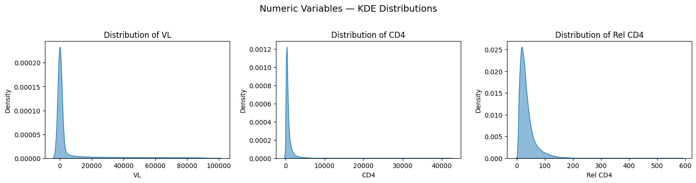
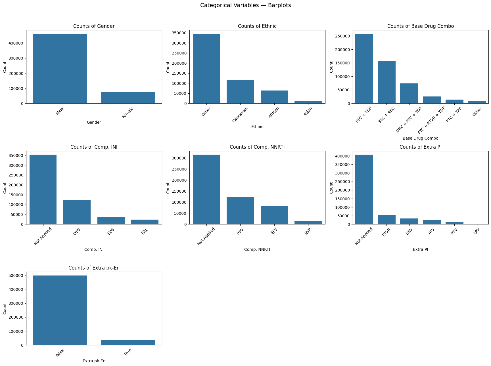

# Hands On with ART for HIV  

Hey, hello, and Kia Ora!

Welcome to this little walkthrough on how to load and play around with Health Gym’s ART for HIV dataset.  
We’ll grab the data, and then having some fun visualising it.  

---

## About the Dataset  

We partnered with the [EuResist Integrated Database (EIDB)](https://www.euresist.org/) to create the Antiretroviral Therapy for HIV (ART for HIV) dataset. 

After applying our published inclusion and exclusion criteria, we ended up with a cohort of 8,916 people living with HIV.  

You can access the data via  [Figshare](https://figshare.com/articles/dataset/The_Health_Gym_v2_0_Synthetic_Antiretroviral_Therapy_ART_for_HIV_Dataset/22827878?file=40584980).

---

## Quickstart  

You can load and preprocess the raw data with just a few lines of Python:

```python
# === Load and Preprocess Raw Data ===
import pandas as pd

raw_url = "https://figshare.com/ndownloader/files/40584980"
All_Data = pd.read_csv(raw_url)
All_Data = All_Data.drop(['VL (M)', 'CD4 (M)'], axis=1)

All_Data.replace({
    "Gender":          {1: "Male", 2: "Female"},
    "Ethnic":          {1: "Asian", 2: "African", 3: "Caucasian", 4: "Other"},
    "Base Drug Combo": {0: "FTC + TDF", 1: "3TC + ABC", 2: "FTC + TAF", 
                        3: "DRV + FTC + TDF", 4: "FTC + RTVB + TDF", 5: "Other"},
    "Comp. INI":       {0: "DTG", 1: "RAL", 2: "EVG", 3: "Not Applied"},
    "Comp. NNRTI":     {0: "NVP", 1: "EFV", 2: "RPV", 3: "Not Applied"},
    "Extra PI":        {0: "DRV", 1: "RTVB", 2: "LPV", 3: "RTV", 4: "ATV", 5: "Not Applied"},
    "Extra pk-En":     {0: "False", 1: "True"}
}, inplace=True)

# Drop this one for now...
All_Data = All_Data.drop(columns=['Drug (M)'])
````

Now let's have a peek at the first few rows?

```python
All_Data.head()
```

You should see something like this:

  

with

* Numeric variables: patient’s VL, CD4, and Rel CD4
* Binary & categorical variables: medication regimen combinations
* Demographics: sex and ethnicity — modelled as time series

Every patient has 60 months of data, sampled monthly (`Timestep 0–59`).

That is

```python
All_Data[All_Data["PatientID"] == 0].shape[0]
```

should return `60`.

---

## Let’s Explore

We can quickly check the distributions of our variables, and let's use:

* KDE plots for numeric variables
* Side-by-side bar plots for categorical ones

  
  

---

## Wrapping Up

That’s a wrap for this little hands-on session!

If you’d like to try it yourself, I’ve prepared a Colab notebook in this Github folder.

Cheers,</br>
\- Nic
