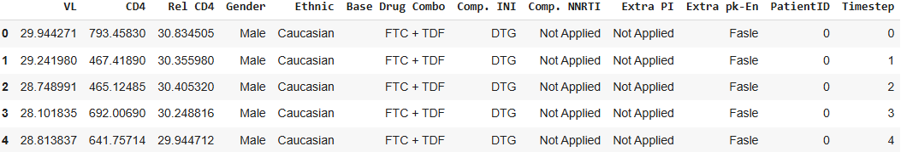

## Hands On with ART for HIV 

The Antiretroviral Therapy for HIV (ART for HIV) dataset is derived from the [EuResist Integrated Database (EIDB)](https://www.euresist.org/), which combines longitudinal treatment and laboratory records from multiple European cohorts.  
Following the published inclusion and exclusion criteria, a cohort of 8,916 people living with HIV was selected.  

The synthetic dataset is publicly accessible via:    
- [Figshare](https://figshare.com/articles/dataset/The_Health_Gym_v2_0_Synthetic_Antiretroviral_Therapy_ART_for_HIV_Dataset/22827878?file=40584980)  

You can directly download and preprocess it with the following code:

```python
# === Load and Preprocess Raw Data ===
import pandas as pd

raw_url = "https://figshare.com/ndownloader/files/40584980"
All_Data = pd.read_csv(raw_url)
All_Data = All_Data.drop(['VL (M)', 'CD4 (M)'], axis=1)

All_Data.replace({
    "Gender":          {1: "Male", 2: "Female"},
    "Ethnic":          {1: "Asian", 2: "African", 3: "Caucasian", 4: "Other"},
    "Base Drug Combo": {0: "FTC + TDF", 1: "3TC + ABC", 2: "FTC + TAF", 
                        3: "DRV + FTC + TDF", 4: "FTC + RTVB + TDF", 5: "Other"},
    "Comp. INI":       {0: "DTG", 1: "RAL", 2: "EVG", 3: "Not Applied"},
    "Comp. NNRTI":     {0: "NVP", 1: "EFV", 2: "RPV", 3: "Not Applied"},
    "Extra PI":        {0: "DRV", 1: "RTVB", 2: "LPV", 3: "RTV", 4: "ATV", 5: "Not Applied"},
    "Extra pk-En":     {0: "False", 1: "True"}
}, inplace=True)

# Let us drop this off for now...
All_Data = All_Data.drop(columns=['Drug (M)'])
```

and if you were to execute
```python
All_Data.head()
```
you will see

We have the numeric variables for a patient's VL, CD4, and Rel CD4, and we have binary \& categorical variables for a patient's medication regimen combination.

Furthermore, notice how the patient demographic, *i.e.,* sex and ethnicity, is also presented as a time series.

If we were to further inspect the data
```python
All_Data[All_Data["PatientID"] == 0].shape[0]
```
you will see that the length is 60. This is because that in this dataset, all patients have 60 months of data, with their data sampled monthly in the rows, corresponding to Timestep 0 ~ 59.

To further inspect the data, let us use KDE plots to show the distribution of the numeric variables, and let us use side-by-side bar plots to represent the binary \& categorical variables.


