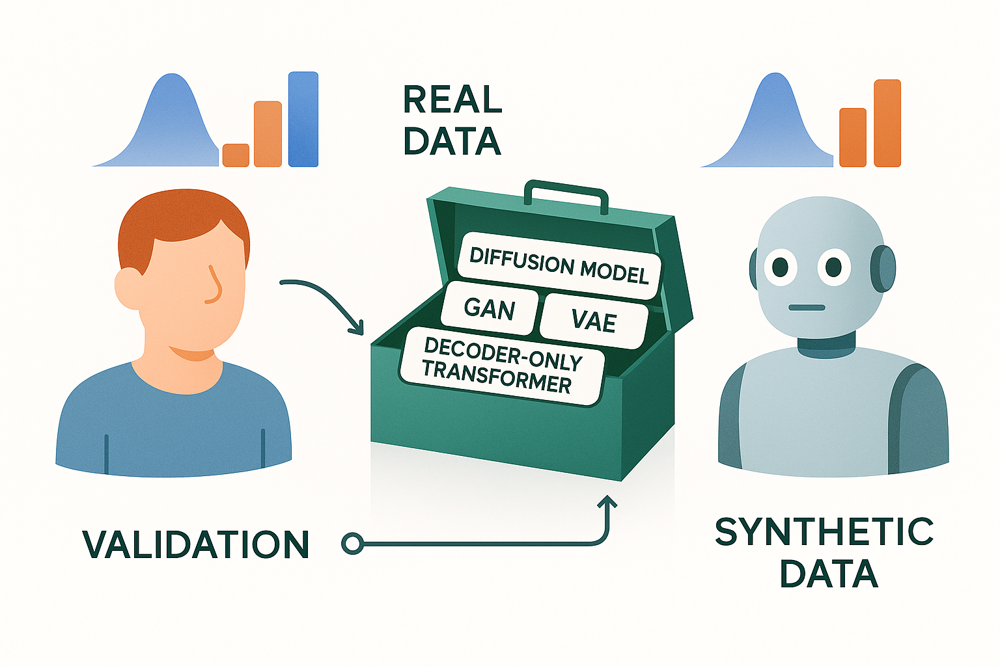

# Synthetic_Data_Related_Project_Staging

This repository will contain staging work related to synthetic data projects.  
Created by Nicholas I-Hsien Kuo.

<!-- Logo and Branding -->

  

---

# About Health Gym

Health Gym [1] is a CBDRH initiative that releases privacy-preserving, realistic synthetic longitudinal EHR datasets and example codes so researchers, educators, and students can build and test models -- from predictive analytics to reinforcement learning -- without accessing identifiable patient data.

* What it provides: mixed-type time series (numeric, binary, categorical), teaching notebooks, and benchmarks for ML/RL, visualisation, survival analysis, and policy learning.
* How it’s built: state-of-the-art generative models (GANs[1, 2] and diffusion probabilistic models [3]) trained on curated cohorts; extensive realism, utility, and privacy evaluations.
* Datasets included:

  * Sepsis (from MIMIC-III [4, 5, 6])
  * Acute Hypotension (from MIMIC-III [4, 5, 6])
  * ART for HIV (from EuResist [7, 8])
* Why it’s safe: ethics approved (UNSW HC210661); rigorous disclosure-risk assessment; and non-identicality checks.
* Who it’s for: educators requiring data mimicking real world complexity, and researchers prototyping methods where access to real clinical data is restricted.

---

<!-- Side-by-side layout: text and illustration -->
<table>
<tr>
<td width="60%">
  
TODO: Insert highlight here

</td>
<td width="40%">
  
</td>
</tr>
</table>

---

<!-- Modelling Toolbox Illustration -->
<table>
<tr>
<td width="60%">

TODO: Insert Synthetic Data Generation Approaches here

</td>
<td width="40%">
  
</td>
</tr>
</table>

---

# Team

<table>
<tr>
<td align="center">
   
  <b>Dr. Nic Kuo (UNSW)</b>
</td>
<td align="center">
   
  <b>Prof. Mark Polizzotto (ANU)</b>
</td>
<td align="center">
   
  <b>Prof. Simon Finfer (UNSW)</b>
</td>
<td align="center">
   
  <b>A/Prof. Sebastiano Barbieri (UQ)</b>
</td>
<td align="center">
   
  <b>Prof-Director Louisa Jorm (UNSW)</b>
</td>
</tr>
</table>

---

<!-- CBDRH Branding -->

  

The Health Gym AI is a collection of research projects of the  
Centre for Big Data Research in Health (CBDRH), UNSW Sydney.  

- Concept created by: Sebastiano Barbieri & Louisa Jorm  
- Clinical domain expertise contributed by: Mark Polizzotto & Simon Finfer  
- Implementation: Nic Kuo  

For any questions or interest in collaboration, please reach out to Nic at [n.kuo@unsw.edu.au](mailto:n.kuo@unsw.edu.au)

---

# References
[1]: Kuo et al., "The Health Gym: Synthetic Health-Related Datasets for the Development of Reinforcement Learning Algorithms." Scientific Data (2022).

[2]: Kuo et al., "Generating Synthetic Clinical Data that Capture Class Imbalanced Distributions with Generative Adversarial Networks: Example using Antiretroviral Therapy for HIV." Journal of Biomedical Informatics (2023).

[3]: Kuo et al., "Synthetic Health-related Longitudinal Data with Mixed-type Variables Generated using Diffusion Models." NeurIPS Workshop on Synthetic Data Generation with Generative AI (2023).

[4]: Johnson et al., "MIMIC-III Clinical Database (version 1.4)." PhysioNet https://doi.org/10.13026/C2XW26 (2016).

[5]: Kuo et al., "Synthetic Acute Hypotension and Sepsis Datasets based on MIMIC-III and Published as Part of the Health Gym Project." arXiv preprint arXiv:2112.03914 (2021).

[6]: Kuo et al., "Synthetic Acute Hypotension and Sepsis Datasets Based on MIMIC-III and Published as Part of the Health Gym Project." PhysioNet https://doi.org/10.13026/p0tv-0r98 (2022).

[7]: Zazzi et al., "Predicting Response to Antiretroviral Treatment by Machine Learning: The EuResist Project." Intervirology (2012).

[8]: Kuo, Nicholas. "The Health Gym v2.0 Synthetic Antiretroviral Therapy (ART) for HIV Dataset." Figshare https://doi.org/10.6084/m9.figshare.22827878.v1 (2023).
