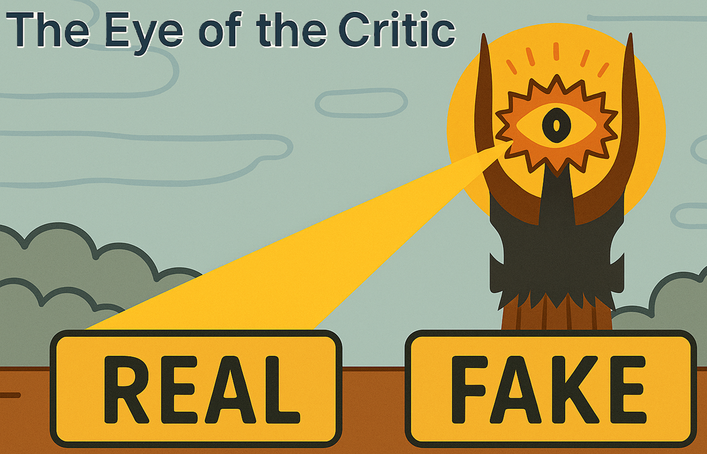

# Health Gym v1: The Eye of the Critic, Part 1

  

Hey, hello, and Kia Ora!

In the last blog we introduced how the Health Gym WGAN-GP model trains with a generator and a critic (or discriminator). This time we’re going to take a closer look at the critic itself -- what exactly it does in the training loop, and how it acts as the judge of realism for synthetic clinical sequences.

---

## The Critic’s Place in the Training Loop

Here’s the simplified pseudocode again:

```text
for epoch in 1..Epochs:
    for L in sorted(keys(Loaders)):         # curriculum over sequence length
        for each batch (X_real, lengths) in Loaders[L]:
            X_real ← X_real.to(device)

            # Critic update(s)
            repeat G_iter times:
                Z      ← SAMPLE_LATENT(num_samples=B, seq_len=L)
                X_fake ← G(Z)

                (A) D_real ← D(X_real)      # critic evaluates real sequences
                (B) D_fake ← D(X_fake)      # critic evaluates fake sequences

                ... gradient penalty omitted for now ...

                L_D ← mean(D_fake) - mean(D_real) + gp
                update critic with L_D

            # Generator update
            Z      ← SAMPLE_LATENT(num_samples=BatchSize, seq_len=L)
            X_fake ← G(Z)
            (E) D_fake ← D(X_fake)          # critic evaluates fake sequences again

            L_G ← - mean(D_fake) + Corr_λ * L_corr
            update generator with L_G
```

Notice how the critic is asked to do three main jobs here: (A), (B), and (E). We’ll call these its roles in rating realism.

---

## (A) Scoring Real Sequences

When the critic sees real patient trajectories (`X_real`), it outputs a scalar score. This is not a probability -- in WGAN-GP we don’t use a sigmoid -- but rather a Wasserstein critic score.

* Higher score = more "real-like".
* This serves as the baseline: the gold standard against which fakes are judged.

---

## (B) Scoring Fake Sequences

Next, the critic scores the generator’s synthetic output (`X_fake`). Ideally, at the beginning these scores are clearly lower than those of real data. Over time, as the generator improves, the critic finds it harder to tell them apart.

* Lower score = less real.
* The gap between real and fake scores is what drives the adversarial game.

---

## (E) Scoring Fakes During Generator Update

Finally, after the critic has been updated, we run it once more on the generator’s latest batch of fakes. But this time the critic is not being trained. Instead, its score is passed back as the adversarial signal that tells the generator: "Your samples look this real to me right now."

The generator’s job is to push those fake scores upward, closer to the real scores.

---

## How Does the Critic Produce a Score?

Let’s look inside the forward pass:

```python
def forward(self, x0):
    # 1. Split real vs categorical inputs
    x_list = [x0[..., :self.max_real]] + [
        f(x0, emb.weight) for f, emb in zip(self.soft_embedding, self.embedding_layers)
    ]
    # 2. Mix features with dense layers
    x1 = torch.cat(x_list, dim=-1)
    x2 = self.leakyReLU(self.linear1(x1))
    x3 = self.leakyReLU(self.linear2(x2))
    # 3. Model temporal patterns with biLSTM
    _, (x4_f, _) = self.rnn_f(x3)
    _, (x4_r, _) = self.rnn_r(x3.flip(dims=[1]))
    x4 = torch.cat((x4_f, x4_r), dim=1)
    # 4. Map to realism score
    return self.linear3(x4)
```

Or conceptually:

```
Real or synthetic sequences
   │
   ├─▶ Numeric vars ──▶ Fully Connected ──▶┐
   │                                       ├─▶ Fully Connected
   └─▶ Categorical/Binary vars ──▶ Soft Embedding ──▶┘
                                               │
                                               └─▶ biLSTM
                                                     │
                                                     └─▶ Fully Connected
                                                           │
                                                           └─▶ Realism score
```

Here’s what’s happening:

1. Numeric variables (like VL, CD4) are passed directly into a linear layer.
2. Categorical/binary variables (like gender, ethnicity, drug combo) are softly embedded into compact vectors.
3. Both streams are fused and mixed through dense layers.
4. A bidirectional LSTM reads the sequence forward and backward to capture temporal patterns.
5. A final linear layer outputs the critic’s realism score.

This is the mechanism behind (A), (B), and (E).

---

## Wrapping Up

In this post we focused on the critic’s first three roles:

* (A) scoring real sequences,
* (B) scoring fake sequences, and
* (E) providing feedback to the generator.

All three revolve around a single core function: rating realism.

In the next post (Part 2), we’ll move to the critic’s remaining roles -- (C) interpolated scoring and (D) gradient penalty -- where we’ll see how the critic’s scores are used to enforce stability and smoothness in training.

Cheers,</br>
\- Nic
