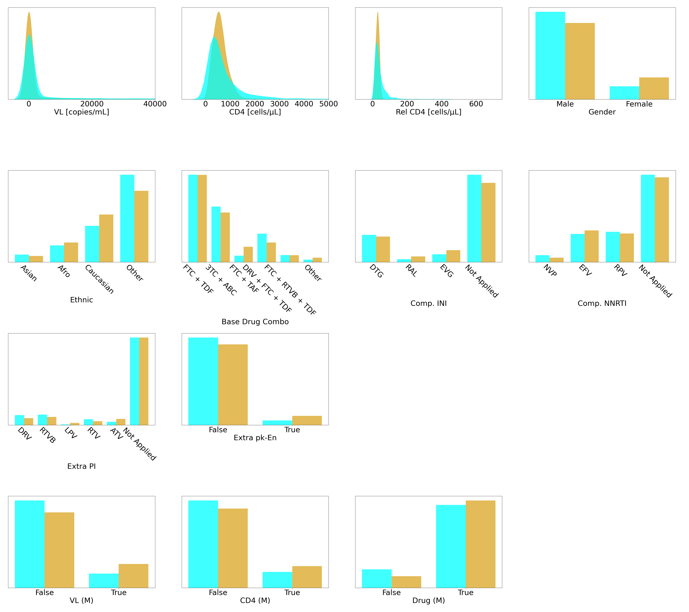
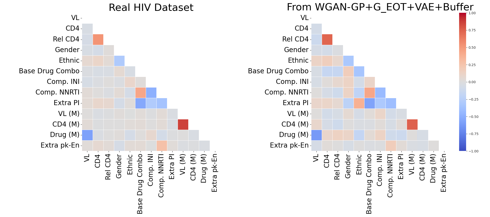
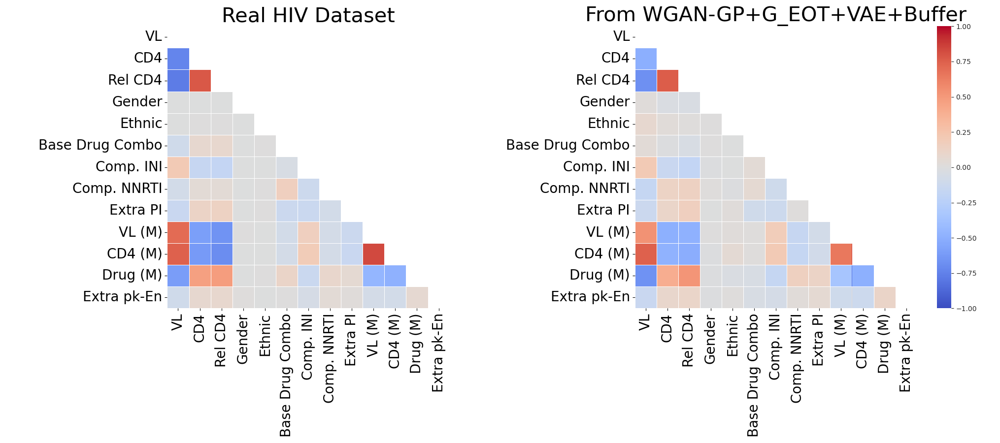
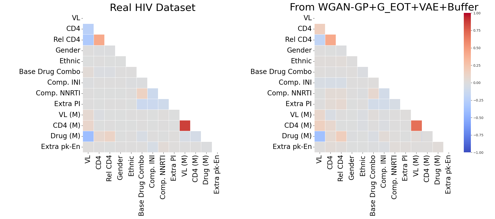
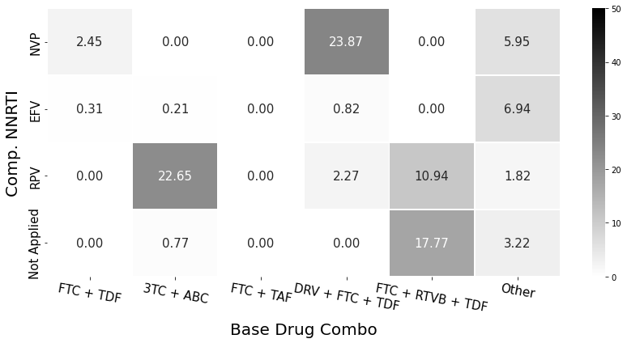
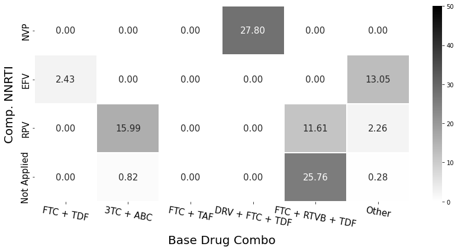

# Exploring the Realism of the ART for HIV Dataset

Hey, hello, and Kia Ora!

In this session, we’ll take a deeper dive into the ART for HIV dataset. We’ll explore not only what the dataset looks like, but also how we check its realism.

---

## About the Dataset

The dataset is derived from the [EuResist Integrated Database (EIDB)](https://www.euresist.org/) and contains 8,916 people living with HIV, each followed monthly for 60 months.

It includes:

* Lab measures: Viral Load (VL), Absolute CD4, Relative CD4
* Demographics: Gender, Ethnicity
* Regimen medication info: Base Drug Combos, Complementary INIs/NNRTIs, Extra PIs, pk-enhancers
* Missingness flags: Whether lab values or regimens were recorded at each time step

This dataset is available publicly on [Figshare](https://figshare.com/articles/dataset/The_Health_Gym_v2_0_Synthetic_Antiretroviral_Therapy_ART_for_HIV_Dataset/22827878?file=40584980); see [this blog](https://github.com/NicKuo-ResearchStuff/Synthetic_Data_Related_Project_Staging/tree/main/Chapters) for a hands-on analysis.

---

## Individual Variable Distributions

First, let’s make sure that the synthetic data resembles the real data at the univatie level.

  

In these plots, gold = real, cyan = synthetic.

* VL and CD4: Right-skewed distributions, well preserved.
* Demographics: Male majority, consistent with the real dataset.
* Medication regimens: Skewed and imbalanced, but faithfully reproduced.
* Missingness flags: Synthetic data captures realistic patterns of when labs are or aren’t measured.

---

## Correlation Alignment

Next, we investige if the relationships among variables hold up.

We check both the static correlations (all data pooled) and dynamic correlations (trends vs cycles within each patient’s time series).

### Static correlations

  

### Dynamic correlations — trends

  

### Dynamic correlations — cycles

  

Highlights:

* VL vs CD4: Strong negative correlation in trends — as treatment lowers VL, CD4 improves.
* Rel CD4 vs CD4: Strong positive correlation.
* Regimen exclusivity: Negative correlations between NNRTIs and INIs.

The synthetic data reproduces all these structures — sometimes slightly weaker, but directionally correct.

---

## Utility Verification with RL

Finally, the big question: is the synthetic data readily available to substitute the ground truth and support the training of ML models?

We test this using offline reinforcement learning (RL) agents that learn to recommend ART regimens.

### Trained on real dataset

  

### Trained on synthetic dataset (our improved model)

  

Each heatmap shows how often the RL agent recommends specific regimen combos.

* On the real dataset: diverse policies, reflecting true clinical practice.
* On the synthetic dataset: remarkably similar patterns, confirming high utility.

---

## Wrapping Up

Through these validation steps, we can see that the ART for HIV dataset attains high level of realism and can be used to replicate similar insights for for downstream modelling.

For more information, please refer to our paper [1].

Cheers,
– Nic

[1]: [Kuo et al., "Generating Synthetic Clinical Data that Capture Class Imbalanced Distributions with Generative Adversarial Networks: Example using Antiretroviral Therapy for HIV." Journal of Biomedical Informatics (2023).](https://www.sciencedirect.com/science/article/pii/S1532046423001570)
