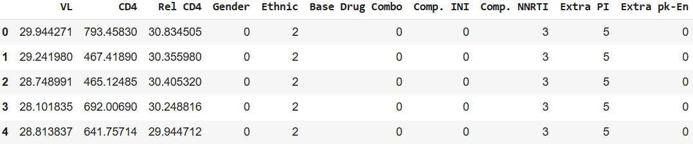
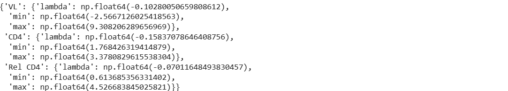
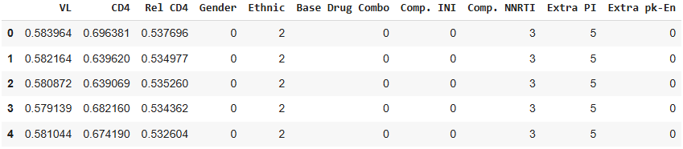

# Implementation 01: Pre-processing the ART for HIV Dataset

Hey, hello, and Kia Ora!

Welcome to the first post in our implementation series for the Health Gym.
In instalment 01, we’ll go step-by-step through the pre-processing pipeline we use before training models on the ART for HIV dataset.

---

## Why Pre-processing?

Our ART for HIV dataset starts off like this:


If this is your first time seeing it, check out the earlier [Hands On with ART for HIV](https://github.com/NicKuo-ResearchStuff/Synthetic_Data_Related_Project_Staging/tree/main/Chapters) blog for a quick introduction.

Raw clinical data is messy. Lab values are skewed, categorical variables are stored as cryptic codes, and models can’t handle string labels.

So we need to:

1. Map categorical variables into numbers.
2. Normalise skewed lab values for stabilising model training.
3. Standardise everything into the comparable ranges of \[0,1].
4. Make sure we can undo all transforms later (*i.e.,* post-processing).

---

## Step 1: Categorical Mapping

Our dataset contains demographics and regimen info stored as strings (*e.g.,* `"Male"`, `"Asian"`, `"DTG"`).
For training, we map them to integers:

```python
def BinCat2Num(df):
    mapping = {
        "Gender": {"Male": 0, "Female": 1},
        "Ethnic": {"Asian": 0, "African": 1, "Caucasian": 2, "Other": 3},
        "Base Drug Combo": {
            "FTC + TDF": 0, "3TC + ABC": 1, "FTC + TAF": 2,
            "DRV + FTC + TDF": 3, "FTC + RTVB + TDF": 4, "Other": 5
        },
        "Comp. INI": {"DTG": 0, "RAL": 1, "EVG": 2, "Not Applied": 3},
        "Comp. NNRTI": {"NVP": 0, "EFV": 1, "RPV": 2, "Not Applied": 3},
        "Extra PI": {"DRV": 0, "RTVB": 1, "LPV": 2, "RTV": 3, "ATV": 4, "Not Applied": 5},
        "Extra pk-En": {"False": 0, "True": 1}
    }
    return df.replace(mapping)
```

We also define the reverse mapping (`BinCat2Str`) so model predictions can be converted back to interpretable labels.

---

## Step 2: Normalisation + Standardisation

Lab values (like Viral Load and CD4 counts) are heavily skewed.
To fix this, we apply:

1. Box–Cox transform to make skewed distributions closer to Gaussian.
2. Min–max scaling to rescale values into \[0,1].

```python
from scipy import stats
from copy import deepcopy

def compute_boxcox_params(df, cols=["VL", "CD4", "Rel CD4"], eps=1e-3):
    params = {}
    for col in cols:
        x = df[col].dropna().astype(float) + eps
        boxcox_transformed, lmbda = stats.boxcox(x)
        params[col] = {
            "lambda": lmbda,
            "min": boxcox_transformed.min(),
            "max": boxcox_transformed.max() - boxcox_transformed.min()
        }
    return params

```

With this setup, lab values are stabilised and normalised, making training smoother and more robust.

And just as we provide a reverse mapping for categorical variables (`BinCat2Str`), we also define inverse transforms for numeric variables (`apply_boxcox_minmax_transform`) so that model outputs can be mapped back into real-world clinical units.

---

## Step 3: Sanity Checks

After applying our transformations:

```python
# === Step 2–4: Transform Dataset ===
All_Data = All_Data.drop(['PatientID', 'Timestep'], axis=1)
ART_Data_Num = BinCat2Num(All_Data)
art_transformation_params = compute_boxcox_params(ART_Data_Num)
ART_Data_Transformed = apply_boxcox_minmax_transform(ART_Data_Num, art_transformation_params)
```

we can run a few quick checks:

```python
ART_Data_Num.head()
```

  

Now, `Gender` and `Ethnic` are integers instead of strings — exactly what our models need.

```python
art_transformation_params
```

  

Here we see the Box–Cox λ and scaling ranges for each lab variable.
These parameters are saved so we can later invert the transforms during post-processing.


```python
ART_Data_Transformed.head()
```

  

Numeric features like VL and CD4 are now cleanly mapped into the \[0,1] range — ready for deep learning.

---

## Wrapping Up

That’s the pre-processing pipeline!

This sets the stage for the next blogs, where we’ll explore embedding these features, feeding them into models, and eventually training RL agents on synthetic health trajectories.

If you’d like to try it yourself, I’ve prepared a Colab notebook in this Github folder.

Cheers,</br>
\- Nic
