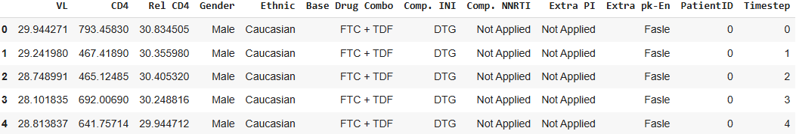
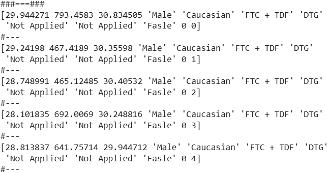
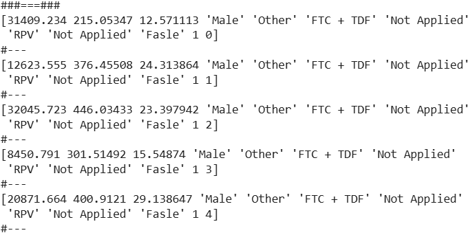

# Implementation 02: From Table to DataLoader

Hey, hello, and Kia Ora!  

Welcome back to our implementation series for the Health Gym.  
In [Implementation 01](https://github.com/NicKuo-ResearchStuff/Synthetic_Data_Related_Project_Staging/tree/main/chapt3), we pre-processed the ART for HIV dataset -- mapping categoricals, normalising skewed labs, and scaling everything into `[0,1]`.  

This time, we’ll take the next step: reshaping the dataset into a patient–timestep structure and creating a PyTorch DataLoader.  
The main goal here is to clarify what the line

```python
data = data.reshape((-1, Cur_Len, Feats_Len))
````

actually does; let’s unpack it carefully.

---

## Step 0: Why Reshape?

Our dataset starts out row-based:

  

* Each row is a single patient at a single timestep.
* With the column information of lab values, regimen info, demographics, etc.
* Ordered by `(PatientID, Timestep)` in the last 2 columns.

But neural networks like RNNs or Transformers expect input tensors of shape: `(batch, sequence, features)`.
That means we need to group the rows for each patient into a 60-month time series.

---

## Step 1: Demo with PatientID + Timestep

Before dropping IDs, let’s keep them in (`All_Data_demo`) and reshape with 12 columns:

```python
Cur_Len = 60
arr12 = All_Data.values.reshape((-1, Cur_Len, 12))

demo = arr12[0, :5, :]   # patient 0, timesteps 0..5
print("###===###")
for first_5_idx in range(5):
  print(demo[first_5_idx, :])
  print("#---")
```
  

Likewise,
```python
demo = arr12[1, :5, :]   # patient 0, timesteps 0..5
print("###===###")
for first_5_idx in range(5):
  print(demo[first_5_idx, :])
  print("#---")
```
  

You’ll see at the far right the pairs `(0,0) ... (0,5)` for patient 0, and `(1,0) ... (1,5)` for patient 1.
This proves that reshape is cleanly grouping rows into patients and timesteps.

---

## Step 2: For Modelling — Drop IDs

For training, we don’t want the model to see PatientID or raw timestep, so we drop them.
That leaves 10 features, `Feats_Len = 10`, used in the `Execute_C003` function

```python
data = data.reshape((-1, Cur_Len, Feats_Len))
data = utils.TensorDataset(
                torch.from_numpy(data).float(),
                torch.full((Pat_Len, 1, 1), Cur_Len),
                )
trn_loader = utils.DataLoader(
                    data,
                    batch_size=Hyper001_BatchSize,
                    shuffle=True,
                    drop_last=True
                    )
```
---
## Wrapping Up

So, to recap:

* `reshape((-1, Cur_Len, Feats_Len))` reorganises row-based data into `(patients, timesteps, features)`.
* We demonstrate, with the IDs, to show the alignment.
* But for modelling, we strip IDs and keep only clinically relavent features (10 columns).
* The `DataLoader` then gives us patient sequences in minibatches.

This sets the stage for the next implementation blog, where we’ll start embedding features!

Cheers,</br>
\- Nic
