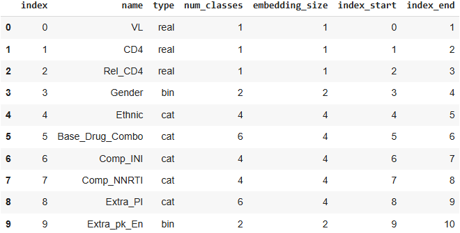
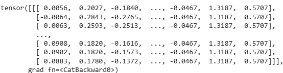
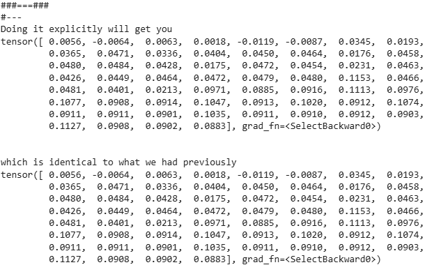

# Implementation 03: Embedding Features for ART for HIV

Hey, hello, and Kia Ora!

Welcome back to our implementation series for the Health Gym.
In [Implementation 02](https://github.com/NicKuo-ResearchStuff/Health_Gym_AI/tree/main/Blogs/Blogs_Z_Implementation/Implementation02), we reshaped the pre-processed ART for HIV dataset into `(patients, timesteps, features)` format and created a PyTorch `DataLoader`.

This time, we’ll embed our features, which requires harmonising a mix of continuous values (*e.g.,* viral load, CD4 counts) and categorical variables (*e.g.,* gender, regimen choice).

---

## Step 0: Why Embed?

Neural models requires each timestep to be represented by a dense vector of real numbers.
But our pre-processed dataset has continuous lab measurements (already as numeric) as well as medication information stored as categorical levels (as integers).
  

We need to map both into learnable embedding vectors.

---

## Step 1: Define the Feature Schema

We start by creating a schema that tells us, for each feature:

* its type (`real`, `categorical`, or `binary`)
* how many classes it has (if categorical)
* how large the embedding vector should be

```python
dtype = pd.DataFrame([
          [0,           "VL",               "real",   1,              1,                  0,              1],
          [1,           "CD4",              "real",   1,              1,                  1,              2],
          [2,           "Rel_CD4",          "real",   1,              1,                  2,              3],
          [3,           "Gender",           "bin",    2,              2,                  3,              4],
          [4,           "Ethnic",           "cat",    4,              4,                  4,              5],
          [5,           "Base_Drug_Combo",  "cat",    6,              4,                  5,              6],
          [6,           "Comp_INI",         "cat",    4,              4,                  6,              7],
          [7,           "Comp_NNRTI",       "cat",    4,              4,                  7,              8],
          [8,           "Extra_PI",         "cat",    6,              4,                  8,              9],
          [9,           "Extra_pk_En",      "bin",    2,              2,                  9,              10],
],
columns = ["index",     "name",             "type",   "num_classes",  "embedding_size",   "index_start",  "index_end"])
```
which gives us

  

---

## Step 2: Build the Embedding Module

We now construct a PyTorch module that:

* uses a linear projection (`nn.Linear`) to embed real-valued features
* uses a lookup table (`nn.Embedding`) to embed categorical and binary features
* concatenates the results into one unified vector per timestep

```python
class ARTFeatureEmbedding(nn.Module):
    def __init__(self, feature_df):
        super().__init__()
        self.feature_df = feature_df
        self.embeddings = nn.ModuleDict()
        for _, row in self.feature_df.iterrows():
            name = row["name"]
            ftype = row["type"]
            in_size = int(row["num_classes"])
            out_size = int(row["embedding_size"])
            if ftype == "real":
                self.embeddings[name] = nn.Linear(1, out_size)
            elif ftype in ["cat", "bin"]:
                self.embeddings[name] = nn.Embedding(in_size, out_size)

    def forward(self, x):
        B, T, D = x.shape
        out_feats = []
        for _, row in self.feature_df.iterrows():
            name = row["name"]
            ftype = row["type"]
            start = int(row["index_start"])
            end = int(row["index_end"])
            x_f = x[:, :, start:end]
            if ftype == "real":
                x_f = self.embeddings[name](x_f.view(B * T, 1)).view(B, T, -1)
            else:
                x_f = x_f.squeeze(-1).long()
                num_classes = self.embeddings[name].num_embeddings
                x_f = torch.clamp(x_f, 0, num_classes - 1)
                x_f = self.embeddings[name](x_f)
            out_feats.append(x_f)
        return torch.cat(out_feats, dim=-1)
```

---

## Step 3: Test with a Batch

Let’s grab one minibatch from our `DataLoader` (say `batch_size=32`):

```python
embedder = ARTFeatureEmbedding(dtype)

batch, _ = next(iter(Train_Loader))
cur_data_BatchLoc0 = batch[0].unsqueeze(0)

Embedded_Using_Embedder = embedder(cur_data_BatchLoc0)

Embedded_Using_Embedder
```
this will give us

 

---

## Step 4: Sanity Check

To build confidence, we can compare:

* embedding outputs feature-by-feature (manual application)
* vs the concatenated result from the `ARTFeatureEmbedding` module

```python
x          = cur_data_BatchLoc0
embeddings = embedder.embeddings
print("###===###")
B, T, D = x.shape
out_feats = []
for row_idx, row in feature_df.iterrows():
    name = row["name"]
    ftype = row["type"]
    start = int(row["index_start"])
    end = int(row["index_end"])
    x_f = x[:, :, start:end]
    if ftype == "real":
        x_f = embeddings[name](x_f.view(B * T, 1)).view(B, T, -1)
    else:
        x_f = x_f.squeeze(-1).long()
        num_classes = embeddings[name].num_embeddings
        x_f = torch.clamp(x_f, 0, num_classes - 1)
        x_f = embeddings[name](x_f)

    #---
    print("#---")
    print("Doing it explicitly will get you")
    print(x_f[0, :, 0])
    print("\n")
    print("which is identical to what we had previously")
    print(Embedded_Using_Embedder[0, :, row_idx])
    break
```

 

---

## Wrapping Up

So, to recap:

* We created a feature schema describing each variable in the ART for HIV dataset.
* We built a PyTorch embedding module that projects continuous values through a `Linear` layer, and categorical/bin features through `Embedding` layers.
* The result is a unified, dense vector per timestep, ready to be fed into RNNs or Transformers.

This sets the stage for the next implementation blog, where we’ll connect these embeddings into sequence models.

If you’d like to try it yourself, I’ve prepared a Colab notebook in this Github folder.

Cheers,</br>
\- Nic
