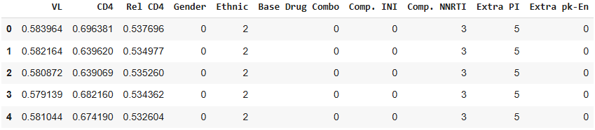

# Implementation 03: Embedding Features for ART for HIV

Hey, hello, and Kia Ora!

Welcome back to our implementation series for the Health Gym.
In [Implementation 02](https://github.com/NicKuo-ResearchStuff/Health_Gym_AI/tree/main/Blogs/Blogs_Z_Implementation/Implementation02), we reshaped the pre-processed ART for HIV dataset into `(patients, timesteps, features)` format and created a PyTorch `DataLoader`.

This time, we’ll embed our features, which requires harmonising a mix of continuous values (*e.g.,* viral load, CD4 counts) and categorical variables (*e.g.,* gender, regimen choice).

---

## Step 0: Why Embed?

Neural models requires each timestep to be represented by a dense vector of real numbers.
But our pre-processed dataset has continuous lab measurements (already as numeric) as well as medication information stored as categorical levels (as integers).
  

We need to map both into **learnable embedding vectors**, so the model can understand relationships (e.g., “DRV” vs “EFV” regimens, “African” vs “Asian” ethnicity).

---

## Step 1: Define the Feature Schema

We start by creating a schema that tells us, for each feature:

* its **type** (`real`, `categorical`, or `binary`)
* how many **classes** it has (if categorical)
* how large the **embedding vector** should be

```python
import pandas as pd

dtype = pd.DataFrame([
    {"name": "VL",             "type": "real",       "num_classes": 0, "embedding_size": 4},
    {"name": "CD4",            "type": "real",       "num_classes": 0, "embedding_size": 4},
    {"name": "Rel_CD4",        "type": "real",       "num_classes": 0, "embedding_size": 4},
    {"name": "Gender",         "type": "categorical","num_classes": 2, "embedding_size": 2},
    {"name": "Ethnic",         "type": "categorical","num_classes": 4, "embedding_size": 3},
    {"name": "Base_Drug_Combo","type": "categorical","num_classes": 6, "embedding_size": 4},
    {"name": "Comp_INI",       "type": "categorical","num_classes": 4, "embedding_size": 3},
    {"name": "Comp_NNRTI",     "type": "categorical","num_classes": 4, "embedding_size": 3},
    {"name": "Extra_PI",       "type": "categorical","num_classes": 6, "embedding_size": 4},
    {"name": "Extra_pk_En",    "type": "binary",     "num_classes": 2, "embedding_size": 2}
])
```

---

## Step 2: Build the Embedding Module

We now construct a PyTorch module that:

* uses a `Linear` layer for **real-valued** features
* uses an `Embedding` layer for **categorical** and **binary** features
* concatenates the results into one unified vector per timestep

```python
import torch
import torch.nn as nn

class ARTFeatureEmbedding(nn.Module):
    def __init__(self, dtype):
        super().__init__()
        self.dtype = dtype
        self.embedders = nn.ModuleDict()

        for _, row in dtype.iterrows():
            if row["type"] == "real":
                self.embedders[row["name"]] = nn.Linear(1, row["embedding_size"])
            else:
                self.embedders[row["name"]] = nn.Embedding(row["num_classes"], row["embedding_size"])

    def forward(self, x):
        outs = []
        for i, row in self.dtype.iterrows():
            feat = x[..., i].long() if row["type"] != "real" else x[..., i].unsqueeze(-1).float()
            outs.append(self.embedders[row["name"]](feat))
        return torch.cat(outs, dim=-1)
```

---

## Step 3: Test with a Batch

Let’s grab one minibatch from our `DataLoader` (say `batch_size=32`):

```python
batch, _ = next(iter(Train_Loader))
print(batch.shape)  # (32, 60, 10)

embedder = ARTFeatureEmbedding(dtype)
emb = embedder(batch)
print(emb.shape)    # (32, 60, total_embedding_size)
```

If we sum the `embedding_size` column from our schema, that’s the dimension of the last axis.
In this setup, it’s `33`, so the output shape is `(32, 60, 33)`.

---

## Step 4: Sanity Check

To build confidence, we can compare:

* embedding outputs feature-by-feature (manual application)
* vs the concatenated result from the `ARTFeatureEmbedding` module

They should be identical. This reassures us that categorical mappings and linear projections are aligned.

---

## Wrapping Up

So, to recap:

* We created a **feature schema** describing each variable in the ART for HIV dataset.
* We built a PyTorch **embedding module** that projects continuous values through a `Linear` layer, and categorical/bin features through `Embedding` layers.
* The result is a unified, dense vector per timestep, ready to be fed into RNNs or Transformers.

This sets the stage for the next implementation blog, where we’ll connect these embeddings into sequence models and start training!

Cheers,</br>
\- Nic

[NOT YET DONE]
