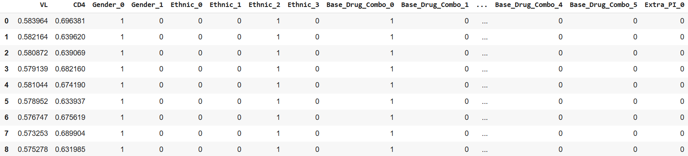

# Shuffling Feature Schema + DataLoader

  

Hey, hello, and Kia Ora!

In [Implementation 02](https://github.com/NicKuo-ResearchStuff/Health_Gym_AI/tree/main/Blogs/Blogs_Z_Implementation/Implementation02), we reshaped the ART for HIV dataset into `(patients, timesteps, features)`.
In [Implementation 03](https://github.com/NicKuo-ResearchStuff/Health_Gym_AI/tree/main/Blogs/Blogs_Z_Implementation/Implementation03), we built a schema to embed those features into dense vectors.
And in the ["White Lies"](https://github.com/NicKuo-ResearchStuff/Health_Gym_AI/tree/main/Blogs/Blogs_Z_Implementation/RethinkingFeatureSchema) blog, I admitted that neither story was fully honest — loading and embedding are always intertwined.

This time, we’ll take a step forward: instead of treating them separately, let’s shuffle them together.

---

## Step 0: A Schema That Spans

Previously, each feature looked like a single neat slot.
But in reality, categorical features demand more space: each category becomes its own one-hot column.

Here’s our updated schema:

```python
dtype = pd.DataFrame([
    ["VL",                "real",     1,             1,                    0,  1],
    ["CD4",               "real",     1,             1,                    1,  2],
    ["Gender",            "bin",      2,             2,                    2,  4],
    ["Ethnic",            "cat",      4,             4,                    4,  8],
    ["Base_Drug_Combo",   "cat",      6,             4,                    8, 14],
    ["Extra_PI",          "cat",      6,             4,                    14, 20],
    ["Extra_pk_En",       "bin",      2,             2,                    20, 22],
], columns=[
    "name",                "type",    "num_classes", "embedding_size",     "index_start","index_end"
])
````

Notice how `index_end - index_start` is no longer always 1 -- it now matches `num_classes`.

---

## Step 1: Why the Extra Width?

Because categorical features don’t collapse into a single number -- they expand into blocks of one-hot columns.

Take a look:

  

Here, `Gender` (2 classes) needs 2 slots,
`Ethnic` (4 classes) needs 4 slots,
and so on.

Our schema now reflects that reality: continuous values stay scalar, but categorical features stretch across multiple columns.

---

## Step 2: Wrapping It Up in Execute_C003

We could stitch everything together manually each time, but that would be painful.
Instead, we bundle it all in a single function:

```python
loader, data = Execute_C003(
    XL, 
    batch_size=256, 
    cur_len=60
)
```

`Execute_C003` is nothing fancy -- just the place where it handles reshaping, batching, and giving us PyTorch DataLoaders.

---

## Step 3: Looking Ahead

So far we’ve:

* reshaped the dataset (Blog 2),
* defined the schema (Blog 3),
* admitted the white lies (Rethinking blog), and
* combined schema + loader into a single workflow (this blog).

If you’d like to try it yourself, I’ve prepared a Colab notebook in this Github folder.

Later, we’ll explore curriculum learning — starting models on shorter sequences, then gradually extending to longer horizons.

Cheers,</br>
\- Nic
