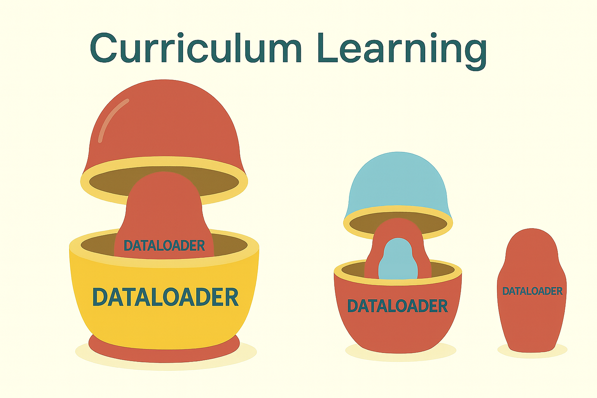

# Curriculum Learning with Nested DataLoaders

  

Hey, hello, and Kia Ora!

In [Implementation 05](https://github.com/NicKuo-ResearchStuff/Health_Gym_AI/tree/main/Blogs/Blogs_Z_Implementation/Implementation05), we demonstrated how the feature schema and the DataLoader are entwined.  

This time, let’s go one step further -- not just how to load the data, but to deal with the length of the sequences utilising curriculum learning.

---

## Step 1: Multiple Loaders, Not One

Instead of a single DataLoader with fixed length sequences, we prepare many loaders, each with a different horizon:  

```

only10_60 = {
10: DataLoader for L=10,
20: DataLoader for L=20,
30: DataLoader for L=30,
40: DataLoader for L=40,
50: DataLoader for L=50,
60: DataLoader for L=60,
}

```

Each loader comes from the same schema + preprocessing pipeline, just sliced to a different length.

```

Figshare CSV  ──▶  DataFrame
│
├─▶ Drop helper cols + map categoricals + scale reals
│
├─▶ Expand schema (one-hot)
│
├─▶ For each target length L ∈ {10,20,30,40,50,60}:
│       └─▶ Reshape to (patients, timesteps=L, features)
│           └─▶ TensorDataset + DataLoader[L]
│
└─▶ Collect into dict only10_60

````

---

## Step 2: What Happens in Training

When we call:

```python
wgan_gp.train(only10_60)
````

the training loop simply sorts the keys and walks through them:

```
for epoch in ...:
    for L in [10,20,30,40,50,60]:
        for batch in DataLoader[L]:
            train critic & generator at length L
```

That’s why the log looks like a ladder:

```
[Epoch 1] L=10 ...
[Epoch 1] L=20 ...
...
[Epoch 1] L=60 ...
[Epoch 2] L=10 ...
...
```

Shorter sequences first, longer ones later, for every epoch.

---

## Step 3: Why Bother?

Training on long sequences is tough -- no matter what backbone the GAN generator uses.  
By beginning with short spans (L=10) and gradually extending to longer ones (up to L=60) within each epoch, we give the model a gentler learning path.  
This staged exposure makes optimisation more stable and improves the generator’s ability to capture dependencies over time.

---

## Step 4: Wrapping Up

That’s the end of our tour of DataLoaders and input pre-processing.  
We’ve gone from raw CSVs, through schema expansion, to multiple loaders that form the backbone of our curriculum learning setup.

From the next blog onward, we’ll switch gears and dive into the WGAN-GP, the model behind Health Gym v1.


Cheers,</br>
\- Nic
