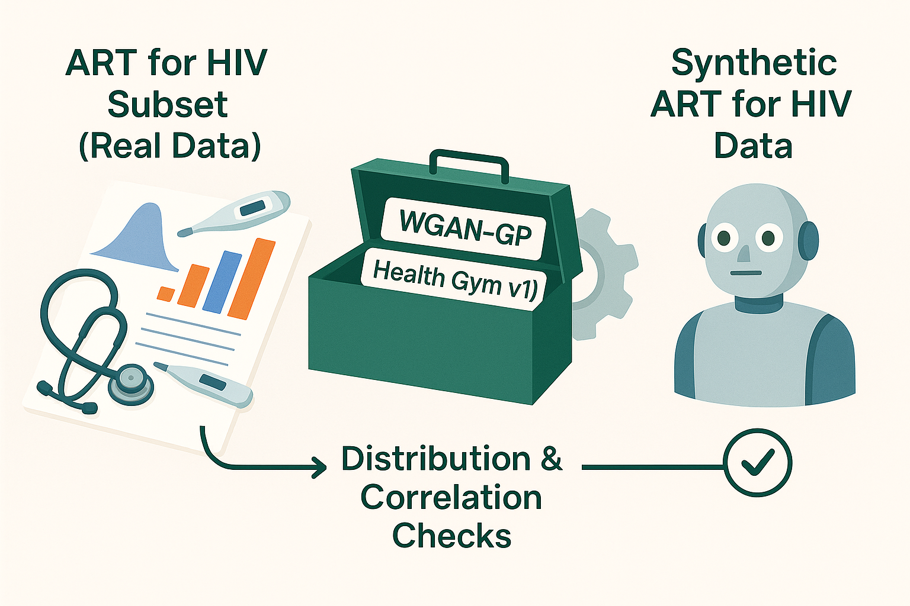
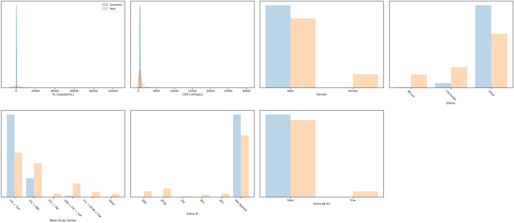
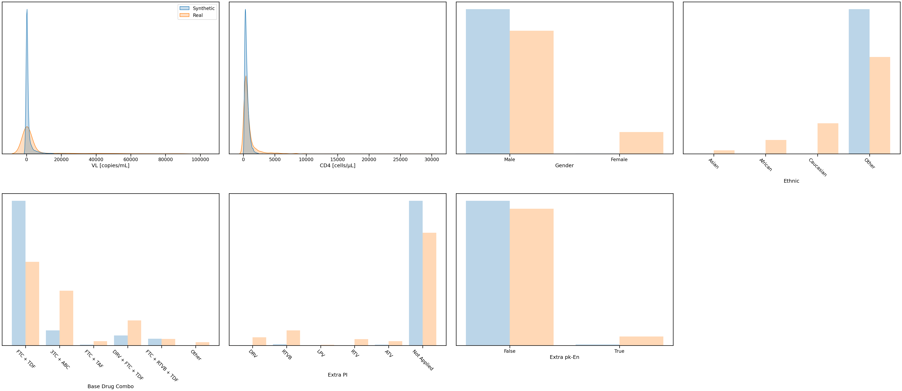

# A Worked Example of ART for HIV using the Health Gym v1 Model (WGAN-GP)

Hey, hello, and Kia Ora!

In this walkthrough, we’ll take a high-level look at how the original Health Gym v1 model works.
Using a smaller subset of the ART for HIV dataset, the code includes the steps on how to create a synthetic copy that mirrors the structure and patterns of the real data.

---

## About this Example

This notebook is a worked sample (see the Google Colab script in this folder), designed to help practitioners quickly understand the core ideas and adapt the code to their own projects.

A few notes up front:

* The code here comes from our Scientific Data 2022 paper,
  “The Health Gym: Synthetic health-related datasets for the development of reinforcement learning algorithms”,
  rather than the later Journal of Biomedical Informatics 2023 paper.
* It shows the Health Gym v1 model (WGAN-GP) in action.
* Performance is therefore a bit more limited than in subsequent versions — but it’s still a solid starting point and naturally connects to our later work.

---

## What This Workflow Does

At a glance, the main steps are:

1. Load the dataset: bring in the ART for HIV cohort.
2. Standardise the data: convert categorical values (*e.g.,* regimens, gender, ethnicity) into numbers, and normalise lab results (VL, CD4) so they’re model-ready.
3. Train the generative model: use the v1 GAN (WGAN-GP) to learn patient trajectories.
4. Generate synthetic data: create new records that look realistic.
5. Evaluate realism: check that the synthetic data preserves key distributions and correlations.

Here’s a more polished and descriptive version of your results section:

---

## Results

After 100 epochs

  

At this stage, the model has captured the broad outlines of the data but with clear limitations:

VL and CD4 have synthetic distributions that generally follow the real curves, but are sharply peaked near zero, a sign of underfitting and early mode collapse.
Demographics and regimens captures the dominant ranking of the categories, yet the proportions are misaligned.

After 200 epochs

  

With further training, the fit improves noticeably. VL and CD4 synthetic curves show greater overlap with the real data, and the exaggerated spike at zero is reduced. Categorical variable distributions begin to shift closer to the real counts, though imbalances remain.

### Takeaway

While the model is far from perfect, these results highlight the progressive improvement achievable with additional training. Fine-tuning parameters, extending training, and applying rebalancing strategies would help close the gaps further.

Importantly, this worked example demonstrates that even the baseline Health Gym v1 (WGAN-GP) can generate synthetic ART for HIV data that reflects the structure of the real cohort. It provides a practical starting point for readers to experiment with, before diving into more advanced models and the detailed implementation blogs that follow.

---

## What’s Next

This worked example is just a first step.
In our upcoming implementation blog series, we’ll unpack the details step by step — from preprocessing pipelines to embeddings and model training — so you can see exactly how the full system works.

Cheers, 
\- Nic
