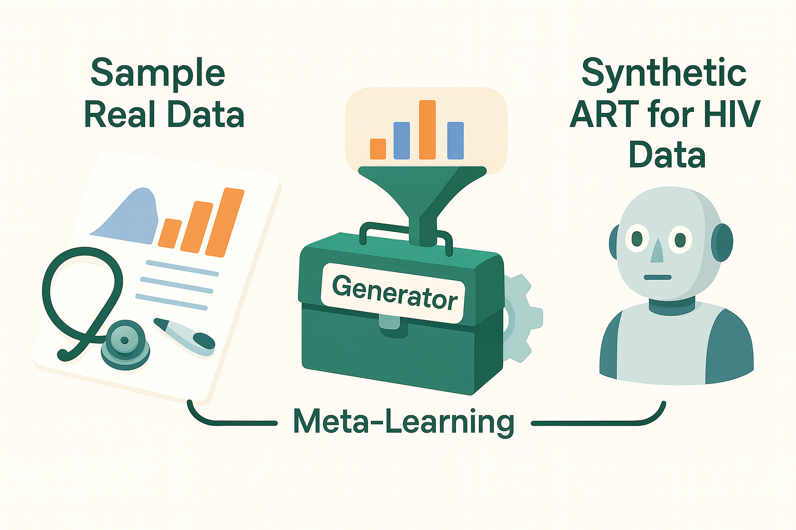
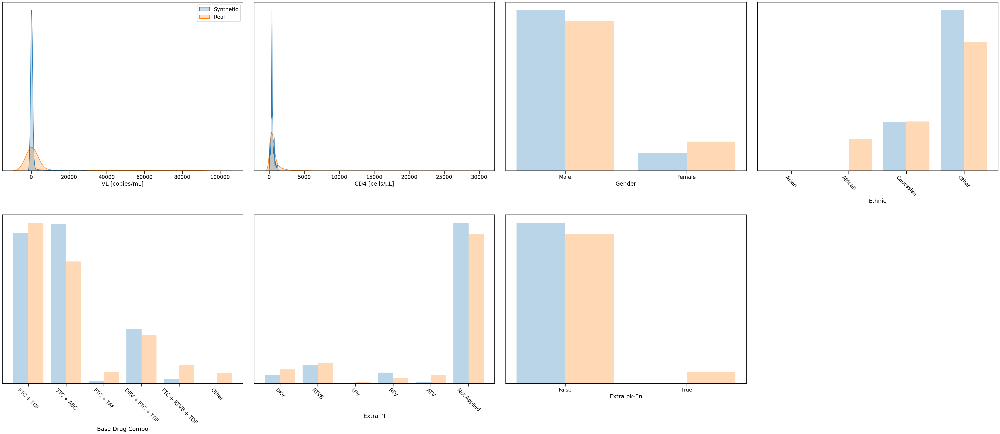
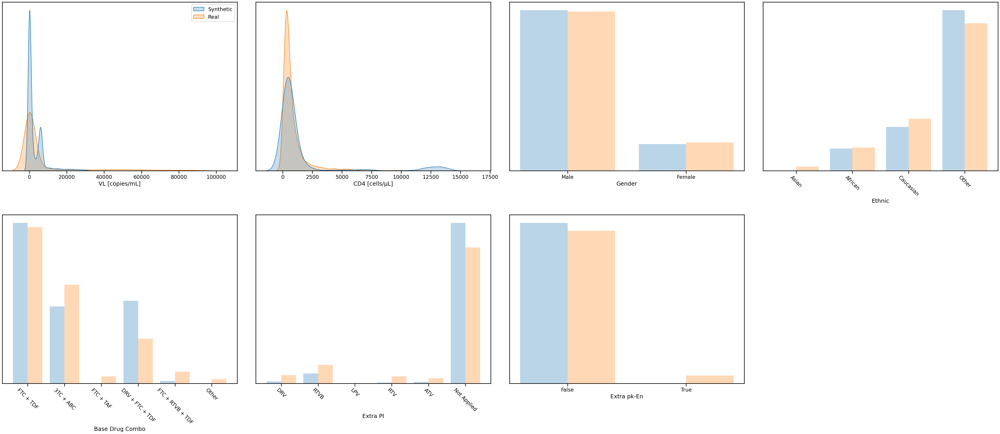

# A Worked Example of ART for HIV using the Health Gym v2 Model (WGAN-GP + VAE + Buffer)

Hey, hello, and Kia Ora!

In this walkthrough, we’ll take a first look at the Health Gym v2 model -- formally called WGAN-GP + VAE + Buffer. This is the natural successor to our original Health Gym v1, which relied on a straightforward GAN. In v2, we introduce a meta-learner: an autoencoder that learns a data-aware latent prior, helping the generator produce more realistic, diverse synthetic trajectories with fewer training samples.

---

## About this Example

As before, this notebook is a worked sample (see the Colab script in this folder) to show practitioners how the updated model works.

A few notes up front:

* The v1 model (Scientific Data 2022), see implementation [here](https://github.com/NicKuo-ResearchStuff/Synthetic_Data_Related_Project_Staging/tree/main/chaptZ), sampled from fixed random noise.
* The v2 model (Journal of Biomedical Informatics 2023) samples from a learned contextual prior, guided by a meta-learner with a latent buffer.
* At a high level, this means the generator doesn’t have to “guess” the data manifold from scratch -- it is informed by patterns already discovered in the real data.

---

## What This Workflow Does

At a glance, the main steps are:

1. Load the dataset: bring in the ART for HIV cohort (as before).
2. Standardise the data: preprocess numeric and categorical features.
3. Meta-learning step: the autoencoder learns latent prototypes and scale parameters, which are stored in a buffer.
4. Train the generative model: the GAN now samples noise conditioned by the meta-learner rather than from a uniform prior.
5. Generate synthetic data: create new ART for HIV trajectories that are more realistic, more stable, and less prone to mode collapse.
6. Evaluate realism: check distributions, correlations, and coverage -- with particular focus on diversity and representation of minority subgroups.

---

## Results

After 100 epochs

  

Already by epoch 100, the v2 model produces synthetic distributions that closely align with the real data. Notice how the VL and CD4 curves overlap more smoothly compared to v1, with fewer artificial spikes near zero. Demographic and regimen categories also begin to reflect real proportions more faithfully.

After 200 epochs

  

By epoch 200, the improvements are clear. The synthetic and real distributions track each other closely, with reduced imbalance across categorical variables. Minority categories and rare regimen combinations are better represented, thanks to the latent buffer guiding the generator.

### Takeaway

Health Gym v2 demonstrates how meta-learning can inform generative modelling. By adding an autoencoder and buffer: the generator receives contextualised noise, improving stability and convergence.

---

## What’s Next

Importantly, this remains a high-level teaching example. We will unpack the details of preprocessing, embedding, and training in upcoming Implementation Blogs, where we’ll directly compare v1 and v2 side by side.

Cheers, 
\- Nic
