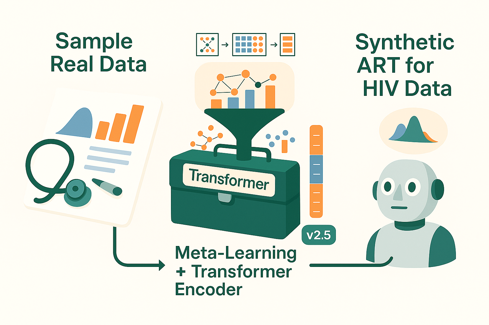
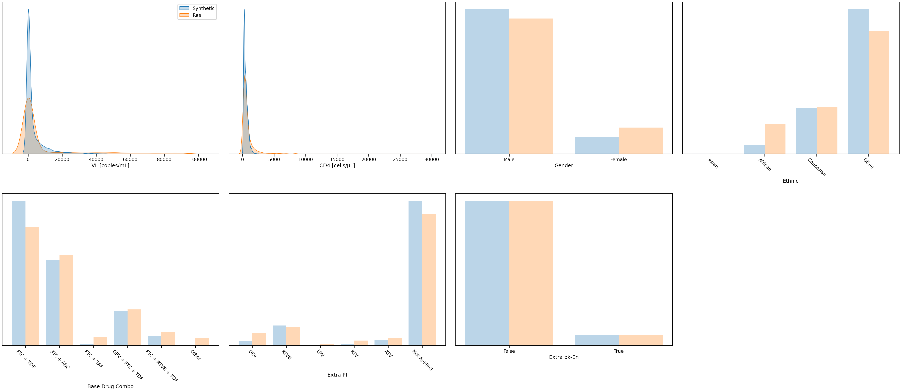
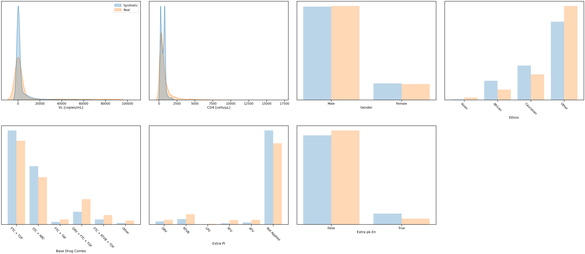

# ART for HIV using the Health Gym v2.5 Model (WGAN-GP + 3EOT + VAE + Buffer)

Hey, hello, and Kia Ora!

In this walkthrough, we’ll explore the Health Gym v2.5 model — the latest step forward in our synthetic data generation journey.
Where v1 relied on a plain GAN, and v2 introduced a meta-learning autoencoder with latent buffers, v2.5 takes the next leap: swapping the recurrent generator for a Transformer encoder.

This change means the generator can capture long-range dependencies across patient trajectories more efficiently, while still benefiting from the contextualised latent prior introduced in v2.

---

## About this Example

As before, this notebook is a worked sample (see the Colab script in this folder) designed to illustrate the model’s workflow.

A few notes up front:

* v1 (Scientific Data 2022) → GAN only, sampling from random noise.
* v2 (JBI 2023) → GAN + VAE + latent buffer, adding contextualised noise.
* v2.5 (this work) → keeps the meta-learning prior of v2 but replaces the generator with an encoder-only Transformer, allowing better modelling of sequence structure.

At a high level, this means the model no longer just “remembers” local patterns step by step (like the LSTM did in v2), but can directly attend across the entire timeline of a patient.

---

## What This Workflow Does

At a glance, the main steps are:

1. Load the ART for HIV cohort.
2. Standardise categorical and numeric variables (as before).
3. Meta-learning step: the autoencoder builds latent prototypes and scales.
4. Train the generative model: now with a Transformer encoder backbone in the generator.
5. Generate synthetic data: richer, more stable trajectories with better global coherence.
6. Evaluate realism: distributions, correlations, and subgroup coverage.

---

## Results

After 100 epochs

  

Already at 100 epochs, we see the benefit of the Transformer backbone: the synthetic VL and CD4 curves align smoothly with the real distributions, without the over-sharp peaks that characterised v1. Categorical distributions also track the real cohort closely, especially for regimen choices.

After 200 epochs

  

By 200 epochs, v2.5 delivers stable overlaps across lab values and demographic variables. Importantly, minority regimen categories are preserved with less distortion, while the Transformer’s attention mechanism improves coherence across sequential features.

### Takeaway

Health Gym v2.5 shows how Transformer-based generators can enhance synthetic health data.
By combining meta-learning from v2 with the sequence-modelling power of attention, we achieve:

* More realistic lab value distributions.
* Better representation of minority categories.
* Improved stability and global consistency in trajectories.

---

## What’s Next

This walkthrough is still high-level. In the upcoming Implementation Series, we’ll unpack:

* How the Transformer generator differs from the LSTM in v2.
* Why attention helps capture patient timelines.
* How to adapt this setup for other health cohorts.

Cheers, 
\- Nic
